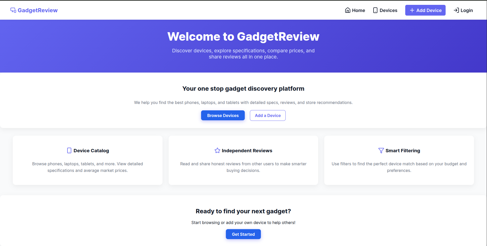
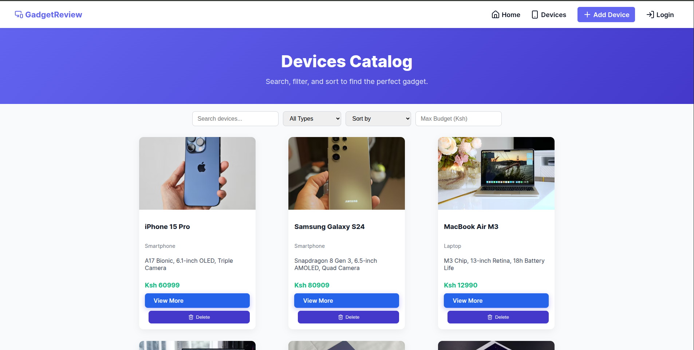
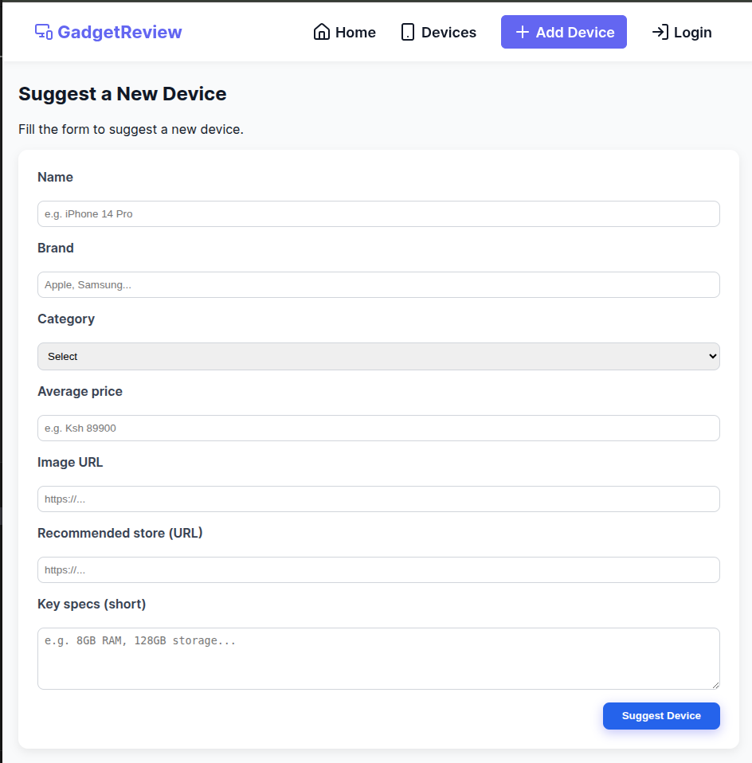

# Gadget_Review App

#### A full-stack web application built with React (frontend) and Flask (backend) to allow users to browse, review, and rate gadgets.

#### By **Samuel Kiplangat and Benson Mwanake**

## Description

The Gadget Review Website is a platform where users can explore different gadgets, read reviews, and share their own experiences. The app demonstrates how a frontend (React) integrates with a backend API (Flask + SQLAlchemy) to perform CRUD operations. Users can add, update, and delete reviews in real time, making it an interactive review hub.

## Screenshot






## Features

- Home page displaying a list of gadgets

- Individual gadget view with detailed information

- User reviews section (create, edit, delete reviews)

- Search and filter gadgets by specifications

Clean, responsive UI for desktop and mobile

## How to Use

### Requirements

- A computer, tablet, or phone
- Access to the internet
- A modern web browser

### View Live Site

Visit the deployed application at: [GadgetReview](https://gadgetreviewsite.netlify.app)

The live site allows you to:

- Browse gadgets and read reviews

- Add your own review after logging in

- Edit or delete reviews you created

- Filter gadgets by name, brand, or specs

### Local Development

If you want to run the project locally, you'll need:

- Node.js installed on your computer
- Basic understanding of React JS
- Code editor (VS Code recommended)
- Terminal/Command Line

#### Installation Process

1. Clone this repository using:

   ```bash
   git clone git@github.com:Benson-Mwanake/GadgetReview.git
   ```

   or by downloading a ZIP file of the code.

2. Navigate to the project directory:

   ```bash
   cd GadgetReview
   ```

3. Install the frontend dependencies:

   ```bash
   cd client
   npm install
   ```

4. Run the frontend server:

   ```bash
   npm start
   ```

5. Open your browser and visit `http://localhost:5000`

6. Install backend dependencies
    ```
    cd ../server
    pipenv install
    ```

7. activate the virtual environment
    ```
    pipenv shell
    ```    

7.Run the backend    
    ```
    cd server
    export FLASK_APP=app.py
    flask run
    ```

## Technologies Used

- React JS
- Vite
- CSS3
- Flask
- SQLAlchemy


## Related Repositories

### Backend API

- Deployed API: [Live API URL](https://gadgetreview-5c3b.onrender.com)

## Support and Contact Details

If you have any questions, suggestions, or need assistance, please contact:

- Email: <samuel.kiplangat@student.moringaschool.com>
         <benson.mwanake@student.moringaschool.com>
## License

MIT License

Copyright &copy; 2025 Samuel Kiplangat

Permission is hereby granted, free of charge, to any person obtaining a copy of this software and associated documentation files (the "Software"), to deal in the Software without restriction, including without limitation the rights to use, copy, modify, merge, publish, distribute, sublicense, and/or sell copies of the Software, and to permit persons to whom the Software is furnished to do so, subject to the following conditions:

The above copyright notice and this permission notice shall be included in all copies or substantial portions of the Software.

THE SOFTWARE IS PROVIDED "AS IS", WITHOUT WARRANTY OF ANY KIND, EXPRESS OR IMPLIED, INCLUDING BUT NOT LIMITED TO THE WARRANTIES OF MERCHANTABILITY, FITNESS FOR A PARTICULAR PURPOSE AND NONINFRINGEMENT. IN NO EVENT SHALL THE AUTHORS OR COPYRIGHT HOLDERS BE LIABLE FOR ANY CLAIM, DAMAGES OR OTHER LIABILITY, WHETHER IN AN ACTION OF CONTRACT, TORT OR OTHERWISE, ARISING FROM, OUT OF OR IN CONNECTION WITH THE SOFTWARE OR THE USE OR OTHER DEALINGS IN THE SOFTWARE.